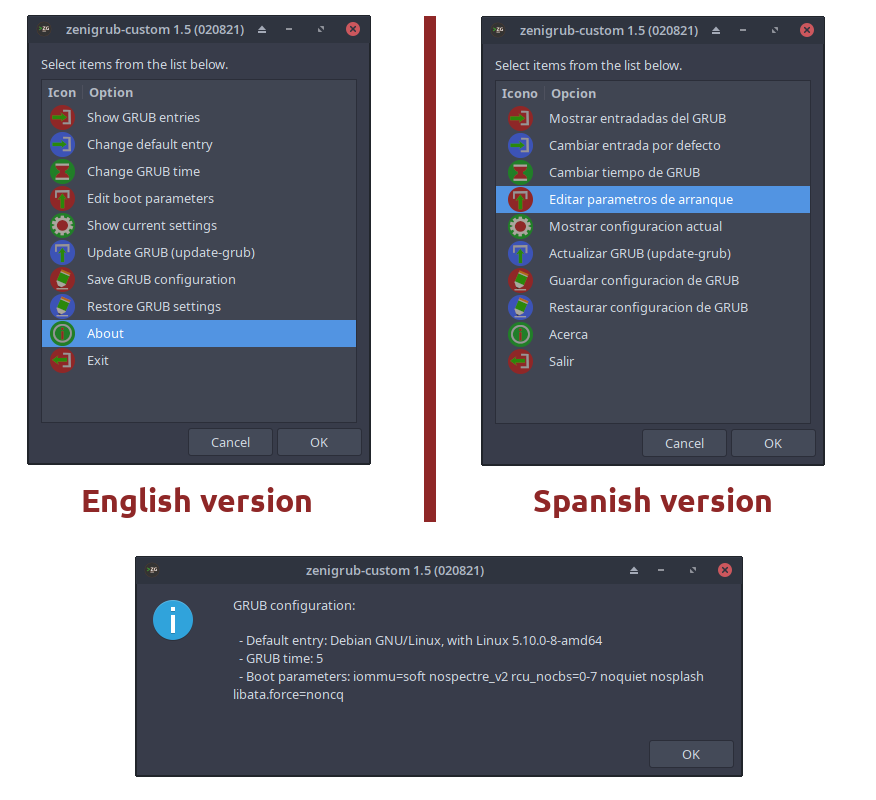

zenigrub-custom - A simple GTK (Zenity) or CLI interface to edit basic settings of GRUB.
=========================================================================================

### Downloads:
  * [zenigrub-custom-1.6.tar.gz](https://github.com/q3aql/zenigrub-custom/releases/download/v1.6/zenigrub-custom-1.6.tar.gz) (Generic Linux)
  * [zenigrub-custom-1.6-en.deb](https://github.com/q3aql/zenigrub-custom/releases/download/v1.6/zenigrub-custom-1.6-en.deb) (Debian/Ubuntu)
  * [zenigrub-custom-1.6-en.rpm](https://github.com/q3aql/zenigrub-custom/releases/download/v1.6/zenigrub-custom-1.6-en.rpm) (RedHat/Fedora)
  * [zenigrub-custom-1.6-en.pkg.tar.zst](https://github.com/q3aql/zenigrub-custom/releases/download/v1.6/zenigrub-custom-1.6-en.pkg.tar.zst) (Arch Linux)
  * [zenigrub-custom-1.6-es.deb](https://github.com/q3aql/zenigrub-custom/releases/download/v1.6/zenigrub-custom-1.6-es.deb) (Debian/Ubuntu - Spanish)
  * [zenigrub-custom-1.6-es.rpm](https://github.com/q3aql/zenigrub-custom/releases/download/v1.6/zenigrub-custom-1.6-es.rpm) (RedHat/Fedora - Spanish)
  * [zenigrub-custom-1.6-es.pkg.tar.zst](https://github.com/q3aql/zenigrub-custom/releases/download/v1.6/zenigrub-custom-1.6-es.pkg.tar.zst) (Arch Linux - Spanish)
  
_Dependencies: bash, coreutils, zenity, xterm, grep, sed_

### Installation (Generic package - English version):

  * Open terminal and run the following commands:

	```shell
	$ tar zxvf zenigrub-custom-1.6.tar.gz
	$ cd zenigrub-custom
	$ sudo make install
	```

### Installation (Generic package - Spanish version):

  * Open terminal and run the following commands:

	```shell
	$ tar zxvf zenigrub-custom-1.6.tar.gz
	$ cd zenigrub-custom
	$ sudo make install-es
	```

### Images (Screenshots - GUI Version)



### CLI Version:

  * For use CLI version, open terminal and run the following command:

	```shell
	$ sudo zenigrub-custom-cli
	```

### External links:

  * [zenity homepage](https://wiki.gnome.org/Projects/Zenity)
  * [xterm homepage](https://invisible-island.net/xterm/)
  * [Coreutils homepage](https://www.gnu.org/software/coreutils/coreutils.html)
  * [Bash homepage](https://www.gnu.org/software/bash/)
  * [Grep homepage](https://www.gnu.org/software/grep/)
  * [sed homepage](https://www.gnu.org/software/sed/)
